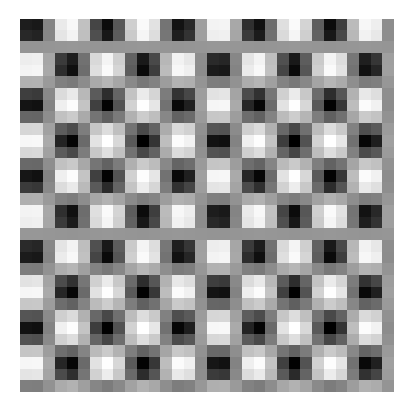
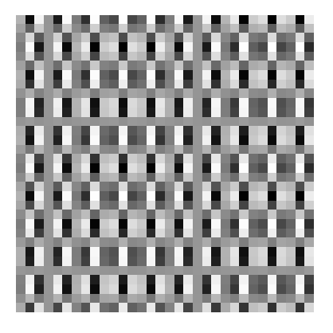
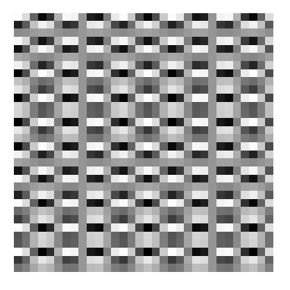
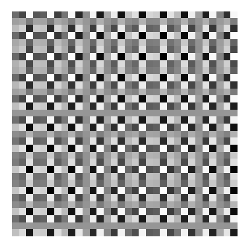
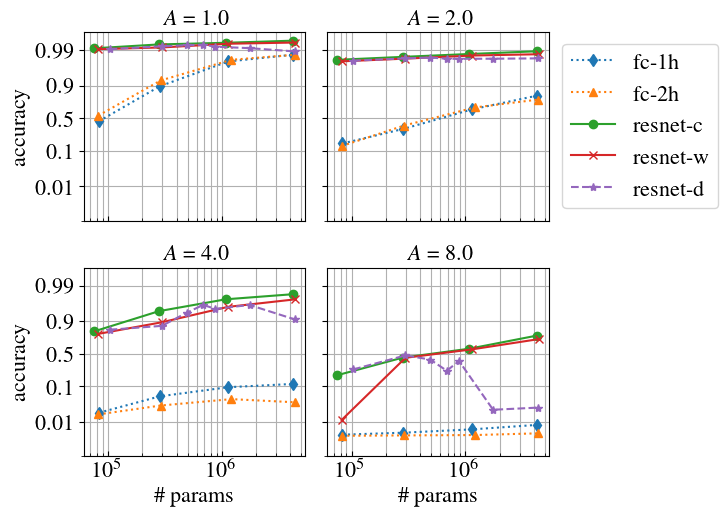

# Using convolutional neural networks for classifying oscilations

Toy example for assesing the ability of convolutional neural networks to classify
different types of oscillations.

## Task description
The task at hand requires a the neural network to distinguish between  the 32 by 32 oscilatory patterns at the input.

1 | 2 | 3| 4
:-:|:-:|:-:|:-:
 |  |   | 

For the images above, however, If the image is downsampled by a factor of two,
the patterns become **indistinguishable due to aliasing**. For the CNN models, 
these downsampling operations happen at intermediate layers and the goal
of this task is to assess what is the resolution CNNs can resolve between distinct 
frequency components at the input.

## Results
The plot bellow shows the accuracy as a function of the number of parameters and for
different noise intensities `A`:

Here `fc-1h` and `fc-2h` are fully connected neural networks with one and two hidden layers,
respectively. First, for the ResNet we increase the number of parameters by fixing the depth
and changing the number of channels in the intermediate layers: 1) keeping the number of 
channels constant across the convolutional layers `resnet-c`; or 2) with the number 
of channels doubling at every block where downsampling takes place  `resnet-w`. 
We also compare it with: 3) keeping the channels constant and increasing the depth 
`resnet-d`. The `y`-axis is in logit scale and the `x`-axis in log scale to
facilitate the visualization.

Bellow we specify the exact structure of each one of the models in the above plot. 
All the fully connected neural networks are defined in the file `fully_connected.py` 
and all resnet architectures are defined in the file `resnet.py`.

- **fc-1**:  one-hidden-layer fully connected neural networks:
`Linear -> ReLu -> Linear -> Softmax`. The next table gives the number
of neurons in the hidden layer:

 | \# hidden neurons | \# params
:-:|:-:|:-:
1 | 58  | 82,810
2 | 200 | 285,400
3 | 800 | 1,140,400
4 | 3000 | 4,275,400

- **fc-2**: fully connected neural network with two hidden layers:
 `Linear -> ReLu -> Linear -> ReLu -> Linear -> Softmax`. The next table gives the number
of neurons in the hidden layer:

 | \# hidden neurons | \# params
:-:|:-:|:-:
1 |  55 |  81,855
2 | 180 | 289,480
3 |  600 | 1,216,000
4 |  1500 | 4,389,400

- **resnet-c**: resnet models with channels constant across the convolutional layers:

 | \# channels per block | \# conv layers per block | \# params
:-:|:-:|:-:|:-:
1 | `[20, 20, 20]` | `[3, 3, 3]` |   81,855
2 | `[40, 40, 40]`  | `[3, 3, 3]` |   297,536
3 | `[80, 80, 80]`  | `[3, 3, 3]` |   1,134,320
4 |  `[160, 160, 160]`  | `[3, 3, 3]` |   4,426,832

- **resnet-w**: resnet models with channels  with the number of channels doubling at 
  every block where downsampling takes place:

 | \# channels per block | \# conv layers per block | \# params
:-:|:-:|:-:|:-:
1 | `[8, 16, 32]` | `[3, 3, 3]` |   81,855
2 | `[16, 32, 64]`  | `[3, 3, 3]` |   297,536
3 | `[32, 64, 128]`  | `[3, 3, 3]` |    1,134,320
4 |  `[64, 128, 256]`  | `[3, 3, 3]` |    1,134,320

- **resnet-d**: resnet models with increasing the depth:

 | \# channels per block | \# conv layers per block | \# params
:-:|:-:|:-:|:-:
1 | `[16, 32, 64]` | `[1, 1, 1]` |   81,855
2 | `[16, 32, 64]`  | `[3, 3, 3]` |   297,536
3 | `[16, 32, 64]`  | `[5, 5, 5]` |    1,134,320
4 |  `[16, 32, 64]`  | `[7, 7, 7]` |    1,134,320
3 | `[16, 32, 64]`  | `[9, 9, 9]` |    1,134,320
4 |  `[16, 32, 64]`  | `[18, 18, 18]` |    1,134,320
4 |  `[16, 32, 64]`  | `[45, 45, 45]` |    1,134,320

## Folder structure

