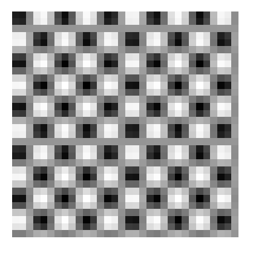
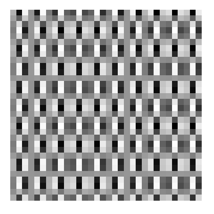
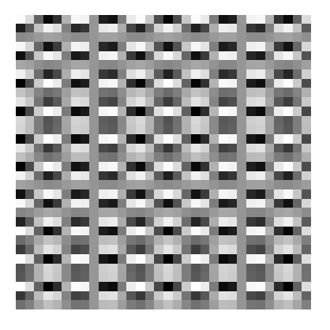
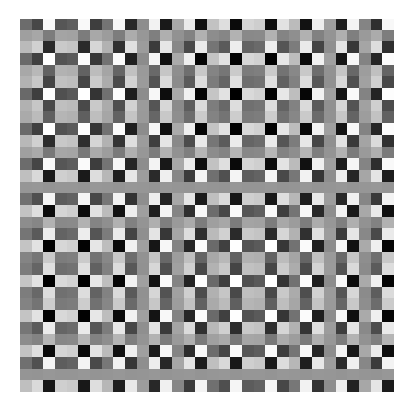
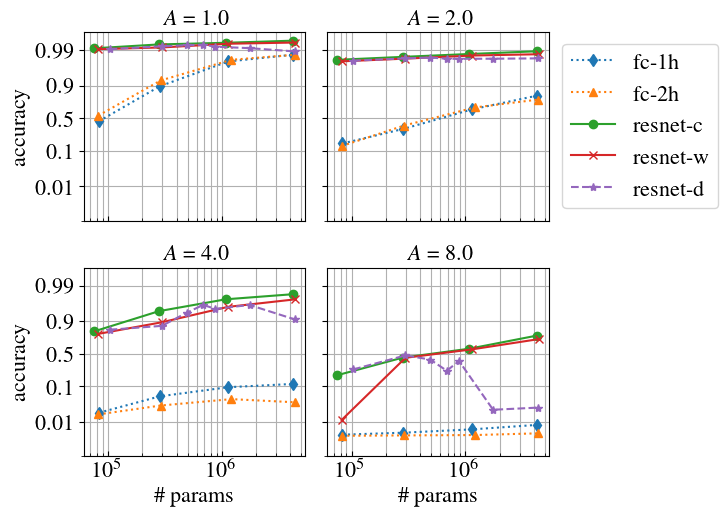

# Using convolutional neural networks for classifying oscillations

Toy example for assessing the ability of convolutional neural networks 
to classify different types of oscillations.

## Folder structure

This folder contain:
- *Python modules*:
    - `data.py`: routines for generating the data according to the proposed experiment. 
     To plot examples of input images, run ``python data.py``.
    - `fully_connected.py`: pytorch implementation of fully connected neural networks used in the experiments.
     To get print a summary of the architecture description run `python fully_connected.py` (the option `--arch` might
     be used to select among the architecture options available)
    - `resnet.py`: pytorch implementation of residual neural networks used in the experiments. To get print a 
    summary of the architecture description run `python resnet.py` (again, the option `--arch` might
     be used to select among the architecture options available)
- *Python scripts*:
    - `train.py`: script for training and evaluating model performance on the problem.
- *Python scripts for plotting*:
    - `plot_performance.py`: script for plotting the performance as a function of the number of
      parameters for different noise levels.
- *Bash scripts*
    - `classifying_oscillations_performance.sh`: bash script for evaluating model performance on diverse settings.
       It repeatedly call `train.py` to execute the experiment in the situations of interest.
       It might be executed by running: `/bin/bash classifying_oscillations_performance.sh results.txt`
       where the last argument specifies where to save the output.

All the python scripts and modules above are equipped with helper functions describing the command-line options.
Run `python [SCRIPT].py -h` from a terminal to get help.

## Task description
The task at hand requires the neural network to distinguish between 
the 32 by 32 oscillatory patterns at the input.

1 | 2 | 3| 4
:-:|:-:|:-:|:-:
 |  |   | 

```bash
# NOTE: Generate figures and save then inside the directory 'img/' by running:
python generate_plot_data.py --save img
```
For the images above, however, If the image is downsampled by a factor of two,
the patterns become **indistinguishable due to aliasing**. For the CNN models, 
these downsampling operations happen at intermediate layers and the goal
of this task is to assess what is the resolution CNNs can resolve between distinct 
frequency components at the input.

## Results

### Plotting the results
The plot below shows the accuracy as a function of the number of parameters and for
different noise intensities `A`:

```bash
# NOTE: Generate figure and save it inside the directory 'img/' by running:
python generate_plot_data.py --input results/results.txt --save img/toy_example_acc.png 
```

### Running the experiments

The results displayed in the above figure are read from the csv file: `results/results.csv`. This csv
file summarizes the experiments and can be generated by running:
```bash
/bin/bash classifying_oscillations_performance.sh results/results.txt
```

### Description
Here `fc-1h` and `fc-2h` are fully connected neural networks with one and two hidden layers,
respectively. First, for the ResNet we increase the number of parameters by fixing the depth
and changing the number of channels in the intermediate layers: 1) keeping the number of 
channels constant across the convolutional layers `resnet-c`; or 2) with the number 
of channels doubling at every block where downsampling takes place  `resnet-w`. 
We also compare it with: 3) keeping the channels constant and increasing the depth 
`resnet-d`. The `y`-axis is in logit scale and the `x`-axis in log scale to
facilitate the visualization.

Below we specify the exact structure of each one of the models in the above plot. 
All the fully connected neural networks are defined in the file `fully_connected.py` 
and all resnet architectures are defined in the file `resnet.py`.

- **fc-1**: family of one-hidden-layer fully connected neural networks:
`Linear -> ReLu -> Linear -> Softmax`. The next table gives the number of
 parameters and the number of neurons in the hidden layer for different
 models we considered.

n | \# hidden neurons | \# params
:-:|:-:|:-: 
1 | 58  | 83,050
2 | 200 | 285,400  
3 | 800 | 1,140,400
4 | 3000 | 4,275,400

- **fc-2**: family of  fully connected neural network with two hidden layers:
 `Linear -> ReLu -> Linear -> ReLu -> Linear -> Softmax`. 
 The next table gives the number of parameters and the number of neurons
 in the hidden layer for different models we considered.

n | \# hidden neurons | \# params
:-:|:-:|:-:
1 |  55 |  81,855
2 | 180 | 289,480
3 |  600 | 1,216,000
4 |  1500 | 4,389,400

- **resnet-c**: family of resnet models with constant depth and constant 
  number of channels over all the convolutional layers. The number of
  parameters varies by increasing the number of channels in the
  intermediary layers, as specified in the following table.

n | \# channels per block | \# conv layers per block | \# params
:-:|:-:|:-:|:-:
1 | `[20, 20, 20]` | `[3, 3, 3]` |   75,020
2 | `[40, 40, 40]`  | `[3, 3, 3]` |   280,840
3 | `[80, 80, 80]`  | `[3, 3, 3]` |   1,086,080
4 |  `[160, 160, 160]`  | `[3, 3, 3]` |   4,270,960


- **resnet-w**: family of resnet models with constant depth and with
 the number of channels doubling at every block where downsampling takes place. The number of
 parameters varies by increasing the number of channels in the
 intermediary layers, as specified in the following table.

n | \# channels per block | \# conv layers per block | \# params
:-:|:-:|:-:|:-:
1 | `[8, 16, 32]` | `[3, 3, 3]` |   81,512
2 | `[16, 32, 64]`  | `[3, 3, 3]` |   297,536
3 | `[32, 64, 128]`  | `[3, 3, 3]` |   1,134,320
4 |  `[64, 128, 256]`  | `[3, 3, 3]` |    4,426,832


- **resnet-d**:  family of resnet models with channels doubling at every block where
 downsampling takes place and constant `[16, 32, 64]`, over all members of the family.
 The number of parameters varies by increasing the depth of the neural network.

n | \# channels per block | \# conv layers per block | \# params
:-:|:-:|:-:|:-:
1 | `[16, 32, 64]` | `[1, 1, 1]` |   103,104
2 | `[16, 32, 64]`  | `[3, 3, 3]` |   297,536
3 | `[16, 32, 64]`  | `[5, 5, 5]` |   491,968
4 |  `[16, 32, 64]`  | `[7, 7, 7]` |    686,400
5 | `[16, 32, 64]`  | `[9, 9, 9]` |    880,832
6 |  `[16, 32, 64]`  | `[18, 18, 18]` |   1,755,776
7 |  `[16, 32, 64]`  | `[45, 45, 45]` |    4,380,608

