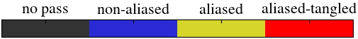
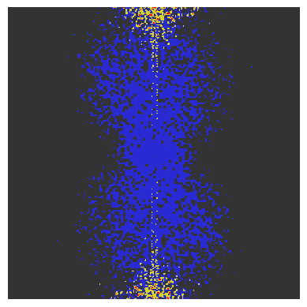
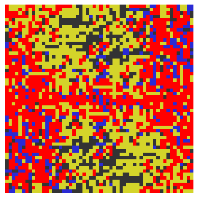
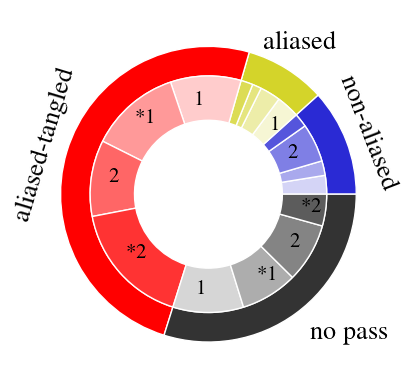
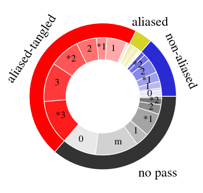
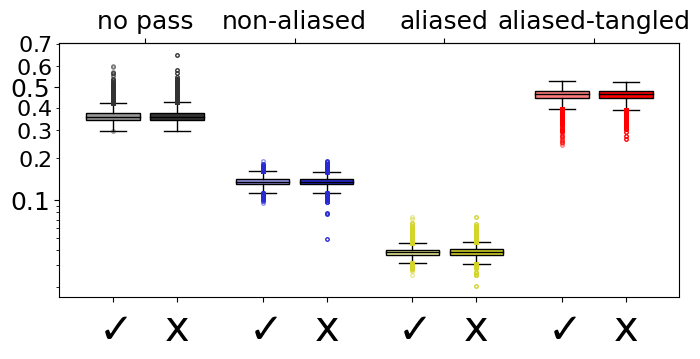
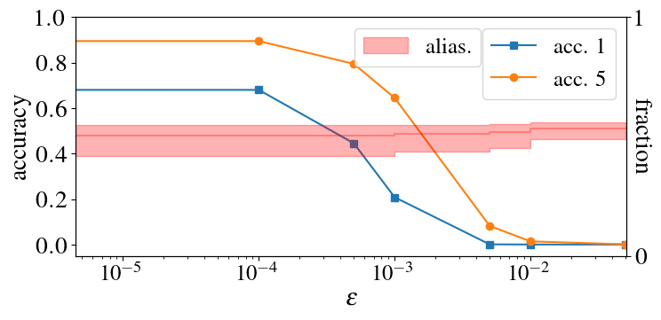

# Quantifying aliasing in convolutional neural networks

In this experiment, we quantify aliasing in a convolutional neural network.

## Preparation (downloading ImageNet)
We use ImageNet on some of the experiments. Please check [image-net.org](http://www.image-net.org/)
to get permission for using it, and also for downloading it.

NOTE: [Academic torrent](http://academictorrents.com/details/207ebd69f80a3707f035cd91a114466a270e044d)
contain some mirror that can be used for downloading the dataset. **These mirrors, however, do not grant
permission for the dataset to be used. Hence, permission should be asked, nonetheless.**
  
For the experiments here we only need the ImageNet validation dataset (which consist of 50,000 images).
Once the ImageNet dataset validation dataset has been downloaded, i.e., the file `ILSVRC2012_img_val.tar`,
you can use the following bash commands to extract and organize the data inside a folder `val/` :
```
mkdir val
tar -C val -xvf ILSVRC2012_img_val.tar
cd val
wget -qO- https://raw.githubusercontent.com/soumith/imagenetloader.torch/master/valprep.sh | bash
```
You can check the total files after extract:
```
find . -name "*.JPEG" | wc -l
```

Along with the documentation we refer to the path to the ImageNet validation folders
as the environmental variable `$IMAGENET_VAL`. Please, attribute it accordingly before calling any of the following
bash commands, i.e.:
```bash
$IMAGENET_VAL=/path/to/val...
```

## Folder structure

This folder contains:

- *Sub-folders*:
    - `img/`: sub-folder containing images generated within this experiment. 
- *Python modules*:
    - `spectral_analyse`: routines for analysing the spectrum of the signals in the intermediary layer.
    - `torch_util.py`: utilities for saving intermediary values in pytorch.
- *Python scripts*:
    - `evaluate.py`: script for evaluating model on task. Possibly saving intermediary layer signals.
- *Python scripts for plotting*:
    - `generate_boxplots.py`
    - `generate_adversarial_example_plot.py`
    - `generate_plots.py`
- *Bash scripts*
    - `pie_and_box_plots.sh`
    - `pixelplots.sh`
    - `adversarial_example_imagenet.sh`
    

All the python scripts above are equipped with helper functions describing the command-line options.
Run `python [SCRIPT].py -h` from a terminal to get help. The bash scripts correspond to 
each of the experiments described below and have as first argument the path for the
ImageNet dataset `/bin/bash [SCRIPT].sh $IMAGENET_VAL`.


## Results

### Classifying aliasing components

In this work, we classify the Discrete Fourier Transform (DFT) of 
the signal immediately after downsampling, according to the
occurrence of aliasing,  into 4 different categories:



The following images show the DFT of intermediary signals of a ResNet 34
classified into these categories when  evaluated in a (correctly 
classified) example from ImageNet.

1 | 2 
:-:|:-:
 | 

```bash
# NOTE: Generate figures and save then inside the directory 'img/' by running:
/bin/bash pixelplots.sh $IMAGENET_VAL
```

### Computing the fraction of samples suffering aliasing

In the paper we also compute the fraction of points in each
category averaged over all the channels and over all the example.
In the following, the image on the left displays the fraction for
ImageNet test set. The outer chart shows the, equally weighted, average
over the 7 intermediate signals under consideration and the inner chart
shows the individual contributions of each intermediate signal to 
the average. 

The image on the right, shows the same experiment for a 
residual neural network with 20 layers (ResNet20)
used for the toy example of classifying oscillations 
see [here](../classifying-oscillations)

ImageNet | Toy experiments
:-:|:-:
 | 

Furthermore, the image bellow, compare the fraction of aliased components for correct vs
incorrect classified examples in ImageNet.



```bash
# NOTE: Generate the three figures and save then inside the directory 'img/' by running:
/bin/bash pie_and_box_plots.sh $IMAGENET_VAL
```


### Computing the fraction of samples suffering aliasing in Adversarial examples

We also analyse the classification of images coming from an adversarial distribution. 
That is, instead of an input `x` from the test set, the neural network will be fed
an input `x+v`, being the vector `v` chosen adversarially to yield the worst possible
model prediction (for which the loss function achieves its highest value) restricted to
`max_i |v_i| ≤ epsilon`. 

The figure below shows the accuracy as a function of the maximum magnitude of the
adversarial disturbance. We use PGD (projected gradient descent) adversarial attack.
The method was originally proposed in [1] and we use the implementation from 
[torchattacks](https://pypi.org/project/torchattacks/) [2],
To generate the adversarial disturbance we use 
100 PGD steps and  maximum step size `2.5 epsilon /100`.


```bash
# NOTE: Generate the above figures and save it inside the directory 'img/' by running:
/bin/bash adversarial_example_imagenet.sh $IMAGENET_VAL
```


[1] Aleksander  Madry,  Aleksandar  Makelov,  Ludwig Schmidt,
 Dimitris Tsipras, and Adrian Vladu,  “Towards Deep Learning 
 Models Resistant to AdversarialAttacks,”Proceedings of 
 the International Conferencefor Learning Representations 
 (ICLR), 2018 [https://arxiv.org/abs/1706.06083](https://arxiv.org/abs/1706.06083)

[2] Hoki Kim, "Torchattacks : A Pytorch Repository for Adversarial Attacks"
 [https://arxiv.org/abs/2010.01950](https://arxiv.org/abs/2010.01950)